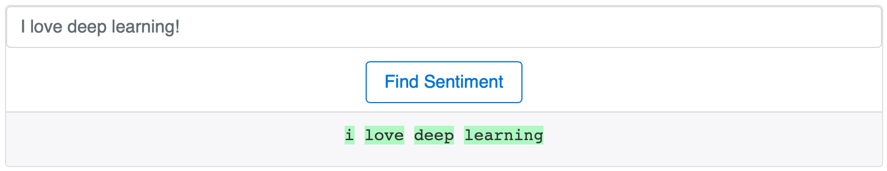
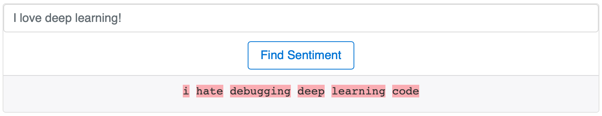

# Flask API for TensorFlow NLP Model

_Francisco Gonzalez_


This an example Flask API for a text classification model written in TensorFlow.
The model is from the [attention_text_classification](https://github.com/franjgonzalez/attention_text_classification) repo and is added here as a submodule.

**Run locally**

```bash
python app.py
```
and open full_client.html on your browser. You should see something like this.

<p align="center">

<br>
Figure 1. Example of positive sentiment sentence.
</p>

<p align="center">

<br>
Figure 2. Example of negative sentiment sentence.
</p>


**References**

1. https://guillaumegenthial.github.io/serving.html
2. https://becominghuman.ai/creating-restful-api-to-tensorflow-models-c5c57b692c10
